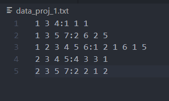
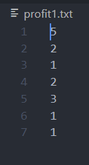

# UP Tree

> > This is a simple library which takes input of transactions and provides it's UP-Tree, HeaderTable, and transactions along with their item-utilities. Each node N of a UP-Tree has six entries: N.item is the item name of N; N. count is the node utility of N; N.num is the support count of N; N.parent indicates the parent node of N; N.nextNode is a node link which may point to a node having the same item name as N.item; N.children which is a dictionary, it contains item name as key and Node as value of all nodes whoes parent is N. The Header table is a structure employed to facilitate the traversal of the UP-Tree. A header table entry contains an item name, an estimated utility value, and a link. The link points to the first node in the UP-Tree having the same item name as the entry. The nodes whose item names are the same can be traversed efficiently by following the links in header table and the node links in the UP-Tree.

## usage:

`upTree,headerTable, transanctions= UPTree(`transaction File path`, `profit file path`)`

### eg:

`upTree, headerTable, transactions = UPTree('D:\user\data_proj_1.txt', 'D:\user\profit1.txt')`

## input format:

> Two text files required. One for transactions(items and quantity) and the other for profit(for each item).

### eg:

## Output:

function returns

1. UP-Tree
2. headertable
3. transactions as dictionary

### UP-Tree

<!-- Format:  -->
